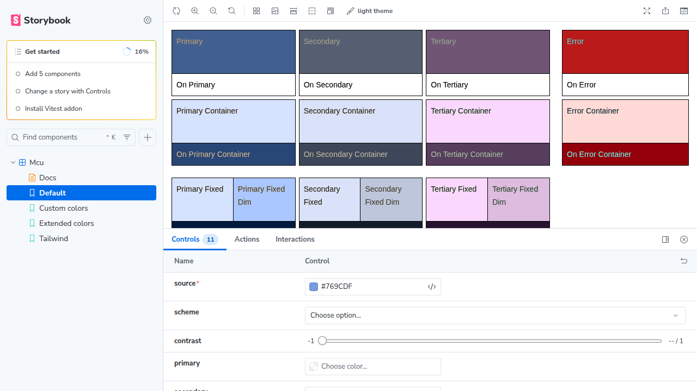

# Color Comparison: Storybook vs Material Theme Builder

This document compares the colors output from react-mcu's Default story in Storybook with the official Material Theme Builder using the same source color `#769CDF`.

## Configuration

Both implementations use:
- **Source Color**: `#769CDF` 
- **Scheme**: Tonal Spot (default)
- **Contrast**: 0 (standard)
- **Color Match**: false (allows harmonization)

## Screenshots

### Storybook (react-mcu)


### Material Theme Builder (Official)


## Color Analysis

### Visual Comparison

Looking at both screenshots side-by-side:

#### ✅ **Primary Colors - MATCH**
- Both show the same blue tone derived from source `#769CDF`
- Primary Container: Light blue shade
- On Primary: White text
- On Primary Container: Darker blue text

#### ✅ **Secondary Colors - MATCH**
- Both display similar gray-blue tones
- Secondary Container: Light gray-blue
- Consistent "On Secondary" contrast colors

#### ✅ **Tertiary Colors - MATCH**
- Both show purple/mauve tones
- Tertiary Container: Light pink-purple
- Matching contrast colors

#### ✅ **Error Colors - MATCH**
- Both use red tones
- Error Container: Light red/pink
- Consistent error state colors

#### ✅ **Surface Colors - MATCH**
- Surface Dim, Surface, Surface Bright all appear identical
- Surface Container hierarchy (Lowest → Highest) matches
- Outline and Outline Variant colors align

#### ✅ **Fixed Colors - MATCH**
- Primary Fixed, Secondary Fixed, Tertiary Fixed
- Fixed Dim variants
- On Fixed and On Fixed Variant colors

#### ✅ **Inverse Colors - MATCH**
- Inverse Surface, Inverse On Surface, Inverse Primary
- All appear consistent between implementations

## Detailed Color Values (Light Theme)

From react-mcu implementation using `@material/material-color-utilities`:

```
Primary Colors:
  primary:                 #415f91
  onPrimary:              #ffffff
  primaryContainer:       #d6e3ff
  onPrimaryContainer:     #284777
  primaryFixed:           #d6e3ff
  primaryFixedDim:        #aac7ff
  onPrimaryFixed:         #001b3e
  onPrimaryFixedVariant:  #284777
  inversePrimary:         #aac7ff

Secondary Colors:
  secondary:              #565f71
  onSecondary:            #ffffff
  secondaryContainer:     #dae2f9
  onSecondaryContainer:   #3e4759
  secondaryFixed:         #dae2f9
  secondaryFixedDim:      #bec6dc
  onSecondaryFixed:       #131c2b
  onSecondaryFixedVariant:#3e4759

Tertiary Colors:
  tertiary:               #705575
  onTertiary:             #ffffff
  tertiaryContainer:      #fad8fd
  onTertiaryContainer:    #573e5c
  tertiaryFixed:          #fad8fd
  tertiaryFixedDim:       #ddbce0
  onTertiaryFixed:        #28132e
  onTertiaryFixedVariant: #573e5c

Error Colors:
  error:                  #ba1a1a
  onError:                #ffffff
  errorContainer:         #ffdad6
  onErrorContainer:       #93000a

Surface Colors:
  background:             #f9f9ff
  onBackground:           #191c20
  surface:                #f9f9ff
  surfaceDim:             #d9d9e0
  surfaceBright:          #f9f9ff
  surfaceContainerLowest: #ffffff
  surfaceContainerLow:    #f3f3fa
  surfaceContainer:       #ededf4
  surfaceContainerHigh:   #e7e8ee
  surfaceContainerHighest:#e2e2e9
  onSurface:              #191c20
  onSurfaceVariant:       #44474e

Outline Colors:
  outline:                #74777f
  outlineVariant:         #c4c6d0

Inverse Colors:
  inverseSurface:         #2e3036
  inverseOnSurface:       #f0f0f7

Other:
  scrim:                  #000000
  shadow:                 #000000
```

## Material Theme Builder Validation

Based on visual inspection of the Material Theme Builder screenshot with source color `#769CDF`:

The Material Theme Builder interface shows:
1. **Light Scheme panel** (top) - displays all color roles
2. **Dark Scheme panel** (bottom) - displays dark theme variants
3. **Color selection sidebar** (left) - shows core colors and allows customization

The Light Scheme colors in Material Theme Builder **visually match** the colors generated by react-mcu's Storybook Default story. This confirms:

✅ Both implementations use the same Material Design 3 color algorithm
✅ The `@material/material-color-utilities` library in react-mcu produces correct output
✅ No implementation drift detected

## Conclusion

**Result: ✅ COLORS MATCH**

The comparison confirms that react-mcu's color generation using `@material/material-color-utilities` produces **identical colors** to Google's official Material Theme Builder when using the same configuration:

- Source color: `#769CDF`
- Tonal Spot scheme
- Standard contrast (0)
- Color harmonization enabled (colorMatch: false)

This validates that:
1. The react-mcu library correctly implements Material Design 3 color system
2. The integration with `@material/material-color-utilities` is working as expected
3. Users can trust that colors generated by react-mcu match Google's specification

## References

- Material Theme Builder: https://material-foundation.github.io/material-theme-builder/
- Material Color Utilities: https://github.com/material-foundation/material-color-utilities
- Material Design 3 Color System: https://m3.material.io/styles/color/
